# Оценка 3. Знакомство с pthread

**1. Создать поток**

Написать программу, которая создает поток с помощью
pthread_create(). Использовать атрибуты по умолчанию.
Родительский и дочерний потоки должны вывести на экран по 5
строк текста.

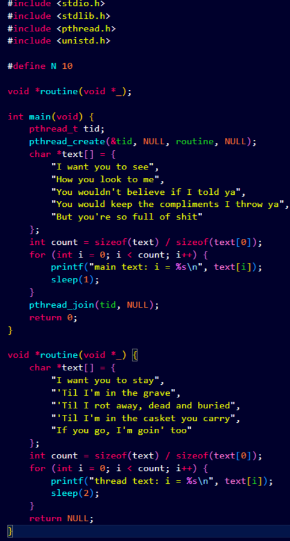

pthread_create(&tid, NULL, routine, NULL) — создание потока
Поток выполняет функцию routine() параллельно с main
Без pthread_join() программа может завершиться до выполнения потока

**2. Ожидание потока**

Модифицировать упр.1 так, что родительский поток выводит текст
после завершения дочернего потока. Подсказка: pthread_join()

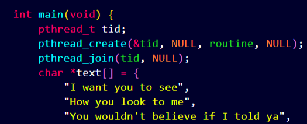

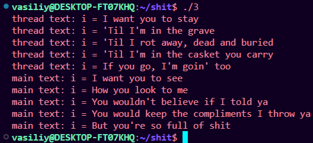

pthread_join(tid, NULL) — ждёт завершения потока

**3. Параметры потока**

Модифицировать упр.2 так, что основной поток создает 4 потока,
исполняющих одну и ту же функцию. Эта функция должна
распечатать последовательность текстовых строк, переданных как
параметр. Каждый из созданных потоков должен распечатать
различные последовательности строк.

структура threadData и создание данных:
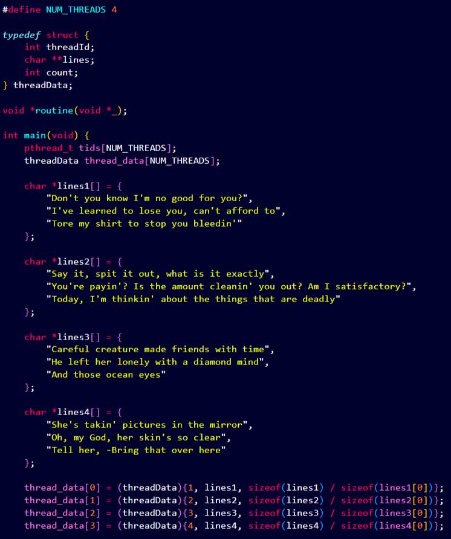

создание потоков и функция routine():
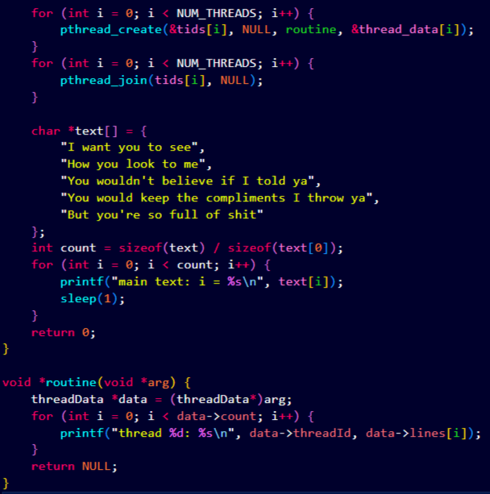

Передача данных через структуру threadData
(threadData){1, lines1, count} — инициализация структуры
В функции потока: threadData _data = (threadData_)arg

4 потока выводят строки:
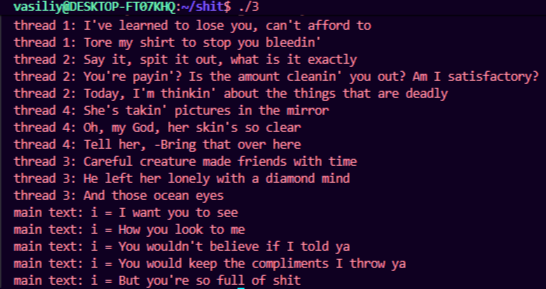

**4. Завершение нити без ожидания**

Добавить сон с помощью sleep() в функцию потоков между выводами
строк. Спустя две секунды после создания дочерних потоков
основной поток должен прервать работу всех дочерних потоков с
помощью pthread_cancel().

sleep(2) и pthread_cancel()
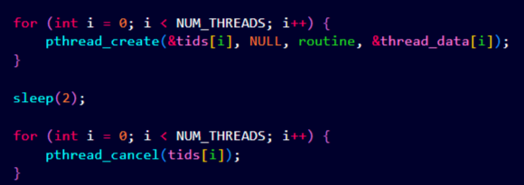

pthread_cancel(tid) — отправляет запрос на отмену потока

результат:
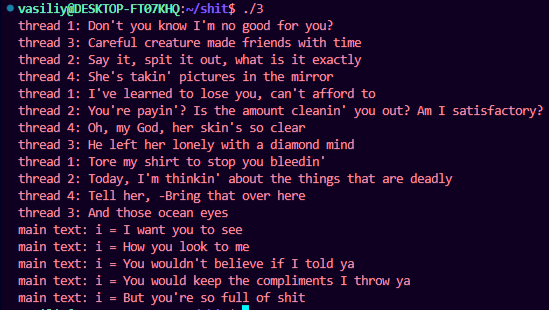

**5. Обработать завершение потока**

Модифицировать упр. 4 так, чтобы дочерний поток перед завершение
распечатывал сообщение об этом. Использовать
pthread_cleanup_push()

pthread_cleanup_push(clean, data)
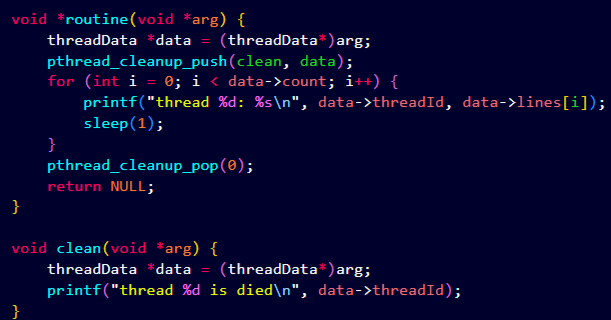

результат:
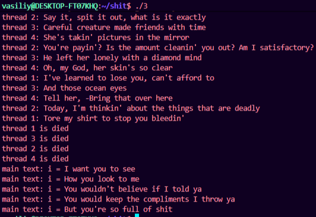

pthread_cleanup_push() — регистрирует функцию-очистку
pthread_cleanup_pop(0) — удаляет обработчик (0 = не выполнять)
Функция clean вызывается при отмене потока

**6. Реализовать простой Sleepsort**

Реализовать прикольный алгоритм сортировки Sleepsort с
асимптотикой O(N) (по времени). Суть алгоритма: на вход подается
массив, пусть будет не более 50 элементов и пусть будет состоять
из целочисленных значений. Для каждого элемента массива
создается отдельный поток, в который в качестве аргумента
передается значение элемента. Сам поток должен уйти в сон с
помощью sleep() или usleep() с параметром равным аргументу потока
(значение элемента массива), а после вывести на экран значение.

полный код sleepsort:
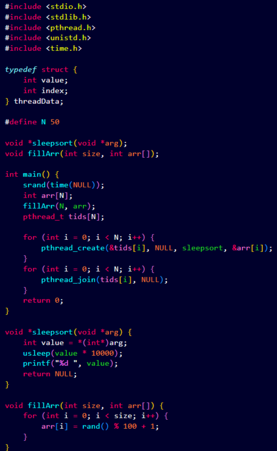

usleep(value \* 10000) — засыпаем пропорционально значению
Меньшие числа просыпаются раньше → выводятся первыми
Сложность: O(N) по времени, но O(N) потоков

результат:
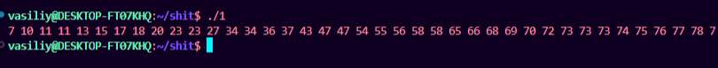

Недостатки:
Для больших чисел надо очень долго спать
Не гарантирует точную сортировку при близких значениях

# Оценка 4. Перемножение матриц

**7. Синхронизированный вывод**

Модифицируйте программу упр. 5 так, чтобы вывод родительского и
дочернего потока был синхронизован: сначала родительский поток
выводить первую строку, затем дочерний, затем родительский
вторую строку и т.д. Использовать mutex.

инициализация mutex, cond, turn, thr_compl
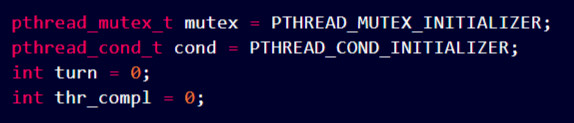

main поток с условными переменными
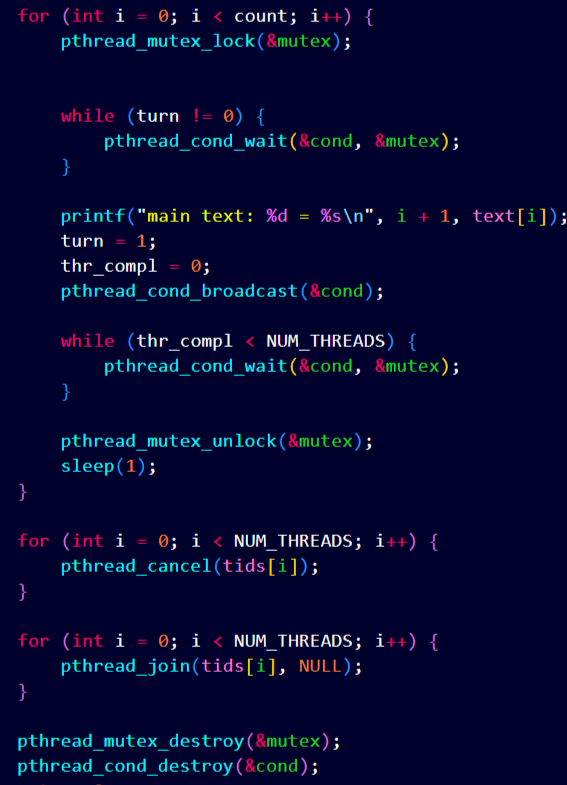

функция потока
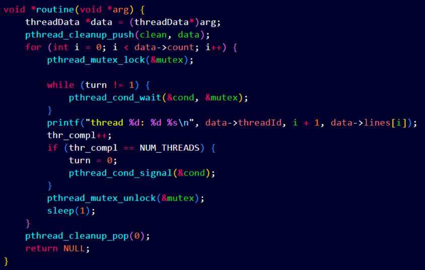

результат синхронизированного вывода
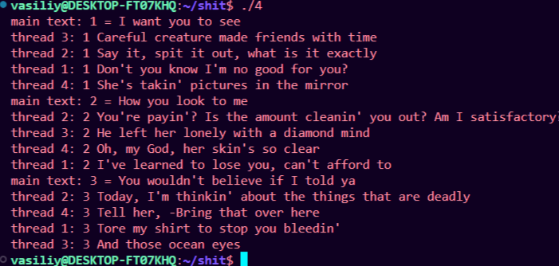

pthread_mutex_lock(&mutex); Вход в критическую секцию
pthread_cond_wait(&cond, &mutex); Ожидание сигнала
pthread_cond_signal(&cond); Сигнал одному потоку
pthread_cond_broadcast(&cond); Сигнал всем потокам
pthread_mutex_unlock(&mutex); Выход

**8. Перемножение квадратных матриц NxN**

a. Написать функцию произведения двух квадратных матриц A и B
размером NxN (на выходе получим матрицу C). Исходные матрицы
A и B заполнить единицами в основном потоке с функцией main.
Для матриц размером меньше 5 в основном потоке вывести на
экран матрицы A, B и C (для проверки правильности работы
функции).

b. С командной строки считать размер матрицы и количество потоков.
Распараллелить перемножение матриц разбив матрицу на равные
части между потоками в главной функции по следующему
принципу: N / threads, например если размер матрицы N = 8, а
потоков 4, то каждый из потоков заберет вычисление N/4 = 2
строки и столбца

c. Дополнительно (не обязательно) Учесть, что размер матриц может
быть не кратен числу потоков, например, N = 18, а число потоков 4,
тогда необходимо каждому из потоков выдать по 4x4, а оставшиеся
2x2 досчитать в основном потоке.

структура ThreadData, выделение памяти
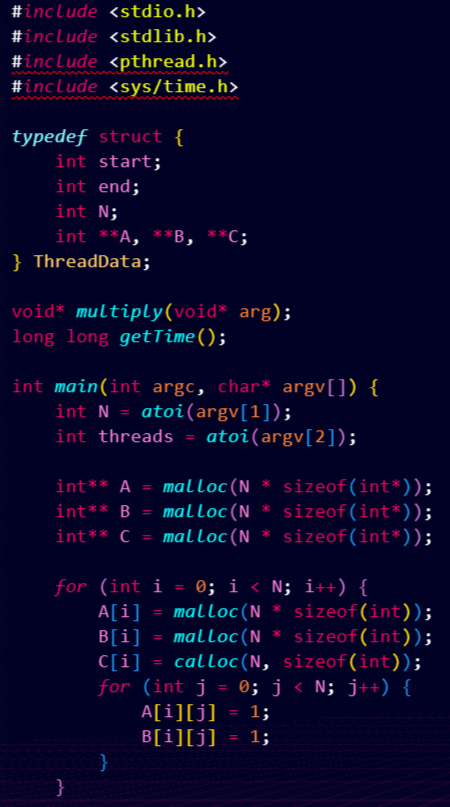

создание потоков, замер времени
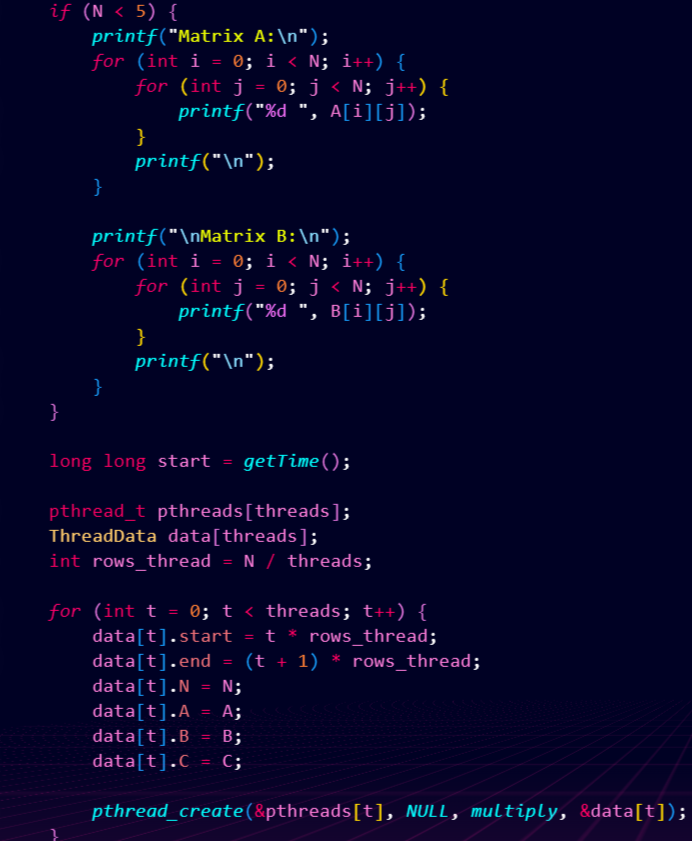

ожидание потоков, вывод результата
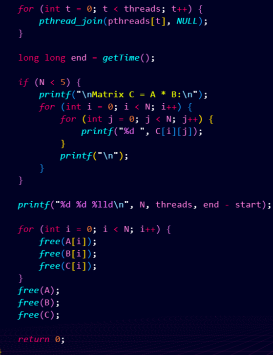

функция умножения multiply(), замер времени
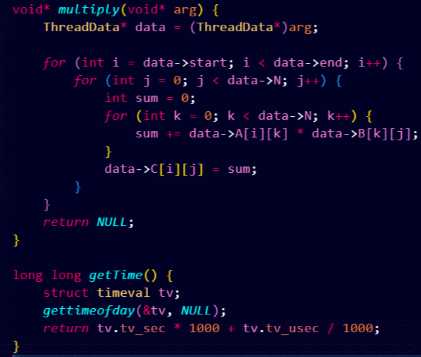

int rows_thread = N / threads; Строк на поток
data[t].start = t _ rows_thread; Начальная строка
data[t].end = (t + 1) _ rows_thread; Конечная строка

**9. Время выполнения**

Замерить время выполнения с момента создания потоков (до цикла с
pthread_create) и до завершения работы потоков (после цикла
pthread_join). Позапускать с разным числом потоков и размером
матрицы. Построить график в любой программе (excel, python,
matlab и т.д.) или онлайн, который покажет зависимость времени
выполнения от размера матрицы и количества потоков. Количество
потоков от 1 до 128 с любым разумным шагом. Размер матрицы не
более 2500, шаг размера матрицы на свое усмотрение. Пример
графика (цветами кол-во потоков, по оси х размер матрицы, по y
время в мс)

Код замера времени:

long long getTime() {
struct timeval tv;
gettimeofday(&tv, NULL);
return tv.tv_sec \* 1000 + tv.tv_usec / 1000;  
}

bash скрипт для тестирования. Записывает полученные данные в файл data.txt, после содержимое файла передаётся в grafik.py
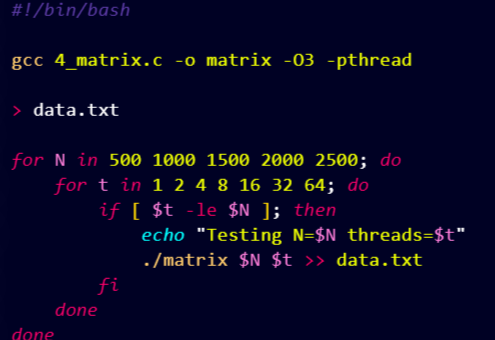

График, показывающий зависимость времени выполнения от размера матрицы:
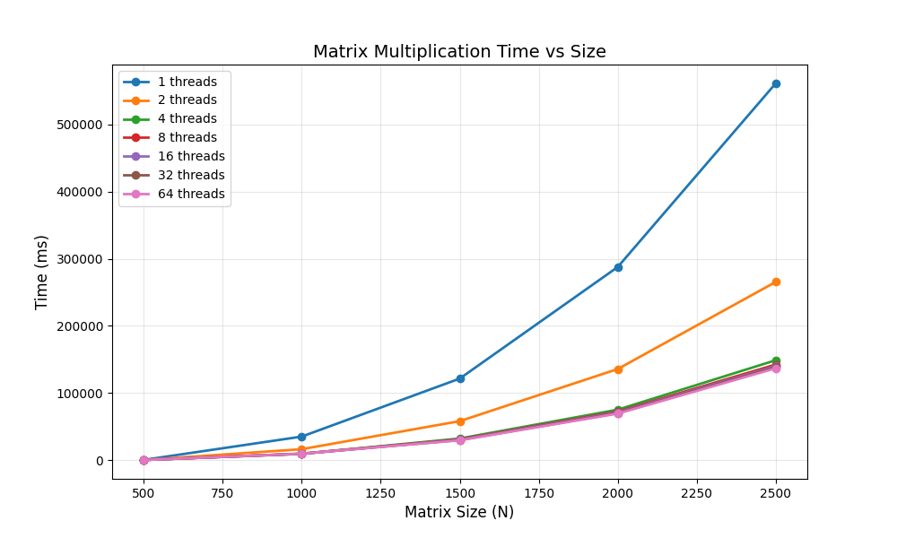
